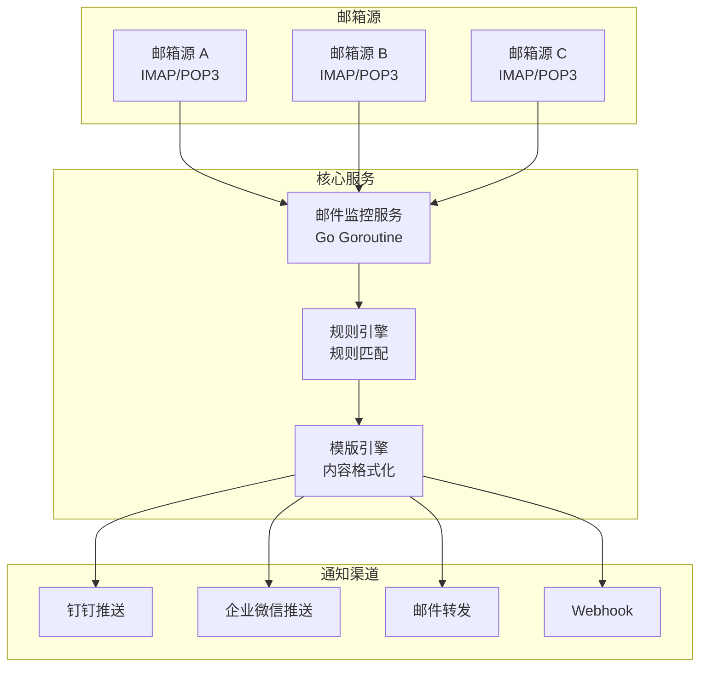

# 📧 统一邮件告警平台
测试地址：http://106.14.79.204:3000/dashboard
默认账号密码 admin/admin


<div align="center">

>  基于 Go + Vue3 的企业级邮件告警管理系统  
> 支持多邮箱监控、智能规则匹配、多渠道通知的统一告警平台

[](https://github.com/wilnight01/emailAlert)
[](https://github.com/wilnight01/emailAlert)
[](https://github.com/wilnight01/emailAlert)

[快速开始](#-快速开始) • [功能特性](#-功能特性) • [技术架构](#️-技术架构) • [部署指南](#-部署指南) • [API文档](#-api文档)

</div>

---

## 📋 目录

- [🎯 项目概览](#-项目概览)
- [⭐ 功能特性](#-功能特性)
- [🚀 快速开始](#-快速开始)
- [🏗️ 技术架构](#️-技术架构)
- [🎛️ 功能模块](#️-功能模块)
- [🔌 API文档](#-api文档)
- [🐳 部署指南](#-部署指南)
- [🔧 开发指南](#-开发指南)
- [📁 项目结构](#-项目结构)
- [📊 开发进度](#-开发进度)
- [📝 更新日志](#-更新日志)
- [📞 联系方式](#-联系方式)

---

## 🎯 项目概览

### 项目状态
**完成度：100%** | **开发阶段：9个阶段全部完成** | **核心功能：已全部实现**

### 系统简介
统一邮件告警平台是一个企业级告警管理系统，专为现代企业设计的智能化邮件监控解决方案：

- 📧 **多邮箱监控** - 同时监控多个邮箱告警源
- 🧠 **智能规则引擎** - 根据自定义规则进行智能分析
- 📢 **多渠道通知** - 通过多种渠道发送格式化告警通知
- 📊 **可视化管理** - 提供完整的监控和管理界面

---

## ⭐ 功能特性

### 🔍 多邮箱告警源接入
- ✅ 支持主流邮箱服务商（Gmail、QQ邮箱、企业邮箱等）
- ✅ 灵活的邮箱配置管理（IMAP/POP3连接信息、监控频率）
- ✅ 稳定的IMAP连接和实时状态监控
- ✅ 连接测试和诊断功能

### 🎯 智能规则引擎
| 特性 | 说明 |
|------|------|
| **多维度匹配** | 支持36种匹配组合（6种类型×6个字段） |
| **三层逻辑运算** | 关键词逻辑 → 条件逻辑 → 规则组逻辑 |
| **匹配类型** | equals、contains、startsWith、endsWith、regex、notContains |
| **邮件字段** | subject、from、to、cc、body、attachment_name |
| **规则优先级** | 1-10级优先级管理，智能去重机制 |

### 📝 自定义模版输出
- 🎨 支持4种模版类型：email、dingtalk、wechat、markdown
- ⚡ 基于Go template语法的强大变量替换引擎
- 👀 实时预览和测试功能
- 📦 丰富的变量系统（邮件、告警、规则、系统、时间变量）

### 📢 多渠道告警触达
- **🏢 企业微信** - 群机器人 + 应用消息双推送模式
- **📱 钉钉消息** - 群机器人 + 工作通知双推送模式
- **🔗 自定义Webhook** - 支持多种HTTP方法、认证方式和数据格式
- **📧 邮件转发** - 支持主流SMTP服务商和多种邮件格式

### 🎛️ 可视化管理界面
- **9个核心管理页面** - 全面覆盖系统管理需求
- **现代化UI设计** - 基于Vue3 + Element Plus，响应式设计
- **智能交互体验** - 实时验证、状态反馈、批量操作

---

## 🚀 快速开始

### 📋 环境要求
- Go 1.21+
- Node.js 18+
- SQLite (自动创建)

### ⚡ 一键启动 (推荐)
```bash
# 1. 克隆项目
git clone https://github.com/wilnight01/emailAlert.git
cd emailElert

# 2. 一键启动前后端服务
./start.sh

# 3. 停止所有服务
./stop.sh
```

### 🌐 访问地址
| 服务 | 地址 | 说明 |
|------|------|------|
| **前端界面** | http://localhost:3000 | 主要管理界面 |
| **后端API** | http://localhost:8080 | API服务端点 |
| **仪表盘** | http://localhost:3000/dashboard | 系统监控面板 |

### 🔐 默认登录信息
```
用户名: admin
密码: admin
配置文件: backend/config/users.json
```

---

## 🏗️ 技术架构

### 💻 技术栈

<table>
<tr>
<td width="50%">

#### 后端技术栈
- **Go 1.21+** + **Gin** - 高性能Web框架
- **GORM** + **SQLite** - ORM框架和轻量级数据库
- **emersion/go-imap** - 稳定的IMAP客户端库
- **Goroutines** - 并发邮件监控

</td>
<td width="50%">

#### 前端技术栈
- **Vue 3** + **Vite** - 现代化前端框架和构建工具
- **Element Plus** - 企业级UI组件库
- **Pinia** + **Vue Router** - 状态管理和路由
- **Axios** - HTTP客户端

</td>
</tr>
</table>

### 🏛️ 架构特点
- **三层架构** - Repository-Service-Handler分层设计
- **微服务化** - 邮件监控、规则引擎、通知分发等独立服务
- **高并发** - 基于goroutine的并发处理架构
- **可扩展** - 接口驱动的模块化设计

### 📊 系统架构图



---

## 🎛️ 功能模块

### 📊 前端页面总览
| 页面 | 功能描述 | 状态 |
|------|----------|------|
| **仪表盘** (Dashboard) | 系统概览和核心指标监控 | ✅ 已完成 |
| **邮箱管理** (Mailboxes) | 邮箱配置和连接管理 | ✅ 已完成 |
| **邮件监控** (Monitor) | 实时邮件监控和服务控制 | ✅ 已完成 |
| **告警规则** (AlertRules) | 多维度规则组管理 | ✅ 已完成 |
| **通知渠道** (Channels) | 四种通知渠道配置 | ✅ 已完成 |
| **消息模版** (Templates) | 模版管理和实时预览 | ✅ 已完成 |
| **告警历史** (Alerts) | 告警记录查询和管理 | ✅ 已完成 |
| **通知历史** (NotificationLogs) | 通知发送记录管理 | ✅ 已完成 |
| **系统监控** (System) | 系统状态和性能监控 | ✅ 已完成 |

### 📡 核心服务
- **邮件监控服务** - 多邮箱并发监控，实时邮件接收和解析
- **规则引擎服务** - 智能规则匹配，支持复杂条件组合
- **模版引擎服务** - 消息模版渲染和变量替换
- **通知分发服务** - 多渠道消息推送和状态管理
- **系统监控服务** - 系统健康状态和性能监控

---

## 🔌 API文档

### 邮箱管理 API
```http
GET    /api/v1/mailboxes              # 获取邮箱列表
POST   /api/v1/mailboxes              # 创建邮箱配置
POST   /api/v1/mailboxes/:id/test     # 测试邮箱连接
PUT    /api/v1/mailboxes/:id          # 更新邮箱配置
DELETE /api/v1/mailboxes/:id          # 删除邮箱配置
```

### 告警规则 API
```http
GET    /api/v1/rule-groups            # 获取规则组列表
POST   /api/v1/rule-groups            # 创建规则组
POST   /api/v1/rule-groups/:id/test   # 测试规则组
PUT    /api/v1/rule-groups/:id        # 更新规则组
DELETE /api/v1/rule-groups/:id        # 删除规则组
```

### 通知渠道 API
```http
GET    /api/v1/channels               # 获取渠道列表
POST   /api/v1/channels               # 创建通知渠道
POST   /api/v1/channels/:id/test      # 测试通知渠道
POST   /api/v1/channels/:id/send      # 发送通知消息
PUT    /api/v1/channels/:id           # 更新通知渠道
DELETE /api/v1/channels/:id           # 删除通知渠道
```

### 消息模版 API
```http
GET    /api/v1/templates              # 获取模版列表
POST   /api/v1/templates/preview      # 预览模版
GET    /api/v1/templates/variables    # 获取可用变量
POST   /api/v1/templates              # 创建模版
PUT    /api/v1/templates/:id          # 更新模版
DELETE /api/v1/templates/:id          # 删除模版
```

### 监控管理 API
```http
POST   /api/v1/monitor/start          # 启动邮件监控
POST   /api/v1/monitor/stop           # 停止邮件监控
GET    /api/v1/monitor/status         # 获取监控状态
GET    /api/v1/system/health          # 系统健康检查
GET    /api/v1/system/stats           # 系统统计信息
```

---

## 🐳 部署指南

### 📦 Docker 部署 (推荐)

#### 快速开始
```bash
# 1. 克隆项目
git clone https://github.com/wilnight01/emailAlert.git
cd emailElert

# 2. 一键Docker部署
docker compose up -d

# 3. 访问服务
# 前端: http://localhost:3000
# 后端: http://localhost:8080
```

#### 自定义镜像构建
```bash
# ARM架构 (Mac M1/M2)
./build-docker-arm.sh

# X86架构 (Linux服务器)
./build-docker-x86.sh

# 构建并推送到镜像仓库
./build-docker-arm.sh -p -v latest
```

#### Docker Compose配置
- **ARM版本**: `docker-compose.yml`
- **X86版本**: `docker-compose-x86.yml`

更多Docker部署详情请参考：[📖 Docker部署指南](DOCKER_README.md)

### 🛠️ 手动部署

#### 后端部署
```bash
cd backend
go mod tidy
go build -o emailAlert main.go
./emailAlert
```

#### 前端部署
```bash
cd frontend
npm install
npm run build
# 将 dist 目录部署到 Web 服务器
```

### 环境变量配置
创建 `backend/.env` 文件：
```env
# 数据库配置
DB_PATH=./data/app.db

# 服务端口
PORT=8080

# 日志级别
LOG_LEVEL=info
```

---

## 🔧 开发指南

### 开发环境搭建
```bash
# 后端开发
cd backend
go mod tidy
go run main.go

# 前端开发
cd frontend
npm install
npm run dev
```

### 开发命令

<table>
<tr>
<td width="50%">

#### 后端开发
```bash
cd backend
make build    # 编译应用
make run      # 运行应用
make test     # 运行测试
make clean    # 清理构建文件
```

</td>
<td width="50%">

#### 前端开发
```bash
cd frontend
npm run dev       # 开发模式
npm run build     # 构建生产版本
npm run preview   # 预览构建结果
npm run lint      # 代码检查
```

</td>
</tr>
</table>

### 代码规范
- **后端** - 遵循 Go 官方代码规范
- **前端** - 遵循 Vue 3 + TypeScript 最佳实践
- **格式化** - 使用 ESLint + Prettier 进行代码格式化
- **质量控制** - 提交前请运行测试和代码检查

---

## 📁 项目结构

```
emailElert/
├── 📄 README.md                  # 项目说明文档
├── 🚀 start.sh                   # 一键启动脚本
├── 🛑 stop.sh                    # 一键停止脚本
├── 🔧 backend/                   # Go后端服务
│   ├── 📄 main.go               # 程序入口
│   ├── 📦 go.mod                # 依赖管理
│   ├── 🐳 Dockerfile            # Docker镜像构建
│   ├── 🐳 docker-compose.yml    # Docker编排
│   ├── ⚙️ config/               # 配置管理
│   ├── 📦 internal/             # 内部包
│   │   ├── 🌐 api/             # API路由和处理器
│   │   ├── 🔧 service/         # 业务逻辑服务层
│   │   ├── 📊 model/           # 数据模型
│   │   ├── 💾 repository/      # 数据访问层
│   │   └── 🔒 middleware/      # 中间件
│   └── 📦 pkg/                 # 可复用的包
│       ├── 📧 email/           # 邮件处理模块
│       ├── 📢 notification/    # 通知模块
│       └── 🛠️ utils/           # 工具函数
└── 🎨 frontend/                # Vue3前端应用
    ├── 📦 package.json         # 依赖管理
    ├── ⚙️ vite.config.js      # Vite配置
    └── 📁 src/
        ├── 🚀 main.js         # 应用入口
        ├── 🎨 App.vue         # 根组件
        ├── 🧩 components/     # 可复用组件
        ├── 📄 views/          # 页面组件
        ├── 🛣️ router/         # 路由配置
        ├── 📊 store/          # 状态管理
        ├── 🌐 api/            # API调用封装
        └── 🖼️ assets/         # 静态资源
```

---

## 📊 开发进度

<div align="center">

### 🎯 整体完成度：100%

</div>

| 阶段 | 功能模块 | 完成状态 | 完成度 |
|:----:|----------|:--------:|:------:|
| 第一阶段 | 基础架构搭建 | ✅ 已完成 | 100% |
| 第二阶段 | 邮箱监控功能 | ✅ 已完成 | 100% |
| 第三阶段 | 系统优化和修复 | ✅ 已完成 | 100% |
| 第四阶段 | 规则引擎开发 | ✅ 已完成 | 100% |
| 第五阶段 | 模版引擎开发 | ✅ 已完成 | 100% |
| 第六阶段 | 多渠道通知 | ✅ 已完成 | 100% |
| 第七阶段 | 监控和管理 | ✅ 已完成 | 100% |
| 第八阶段 | 规则系统优化 | ✅ 已完成 | 100% |
| 第九阶段 | 测试和部署 | ✅ 已完成 | 100% |

### 🎨 项目特色

<table>
<tr>
<td align="center" width="25%">
<b>🚀 高性能</b><br/>
Go语言编写<br/>
支持高并发邮件监控
</td>
<td align="center" width="25%">
<b>🔧 易扩展</b><br/>
模块化设计<br/>
支持自定义通知渠道
</td>
<td align="center" width="25%">
<b>🎨 现代化UI</b><br/>
Vue3+Element Plus<br/>
响应式界面设计
</td>
<td align="center" width="25%">
<b>🐳 容器化</b><br/>
完整Docker方案<br/>
一键部署
</td>
</tr>
<tr>
<td align="center">
<b>📊 可观测</b><br/>
完善的监控<br/>
和日志系统
</td>
<td align="center">
<b>🔒 数据安全</b><br/>
支持软删除<br/>
和数据恢复机制
</td>
<td align="center">
<b>⚡ 稳定连接</b><br/>
优化的IMAP连接<br/>
支持主流邮箱服务商
</td>
<td align="center">
<b>🛠️ 易维护</b><br/>
简化的架构设计<br/>
清晰的代码结构
</td>
</tr>
</table>

---

## 📝 更新日志

### 🎉 v1.0.0 (2024-06-24)
- ✅ **完成所有9个开发阶段**
- ✅ **实现多邮箱监控和智能规则引擎**
- ✅ **支持4种通知渠道**（企业微信、钉钉、Webhook、邮件）
- ✅ **完成前端9个管理页面**
- ✅ **系统测试和部署准备完成**

#### 🌟 主要功能更新
- **多维度规则引擎** - 支持36种匹配组合的复杂规则配置
- **智能通知分发** - 多渠道并发推送和失败重试机制
- **实时系统监控** - 完整的健康状态和性能监控
- **企业级管理界面** - 现代化的可视化管理系统

---

## 📚 文档指南

### 核心文档
- 📖 **[README.md](README.md)** - 项目总览、功能介绍、快速开始
- 🐳 **[DOCKER_README.md](DOCKER_README.md)** - 详细的Docker部署指南

### 构建脚本
- 🔧 **[build-docker-arm.sh](build-docker-arm.sh)** - ARM架构Docker镜像构建（Mac M1/M2）
- 🔧 **[build-docker-x86.sh](build-docker-x86.sh)** - X86架构Docker镜像构建（Linux服务器）

### 部署配置
- ⚙️ **[docker-compose.yml](docker-compose.yml)** - ARM版本容器编排
- ⚙️ **[docker-compose-x86.yml](docker-compose-x86.yml)** - X86版本容器编排

**💡 提示**：已清理重复和专门化文档，保留核心必要文档，降低维护成本。

---

## 📞 联系方式

<div align="center">

**项目维护者：Eason**

[](mailto:willnightzhanglixia@126.com)
[](https://github.com/wilnight01/emailAlert)
[](https://github.com/wilnight01/emailAlert/issues)

---

**🚀 统一邮件告警平台 - 让企业告警管理更智能、更高效！**

[](https://github.com/wilnight01/emailAlert)
[](https://github.com/wilnight01/emailAlert)

</div>
